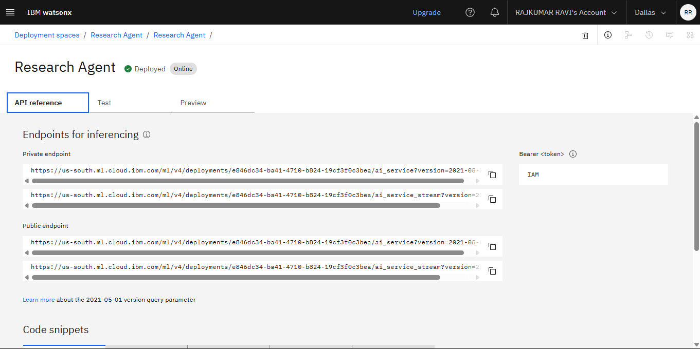
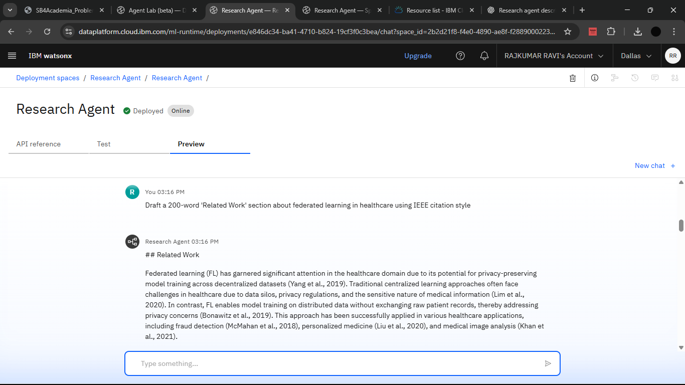
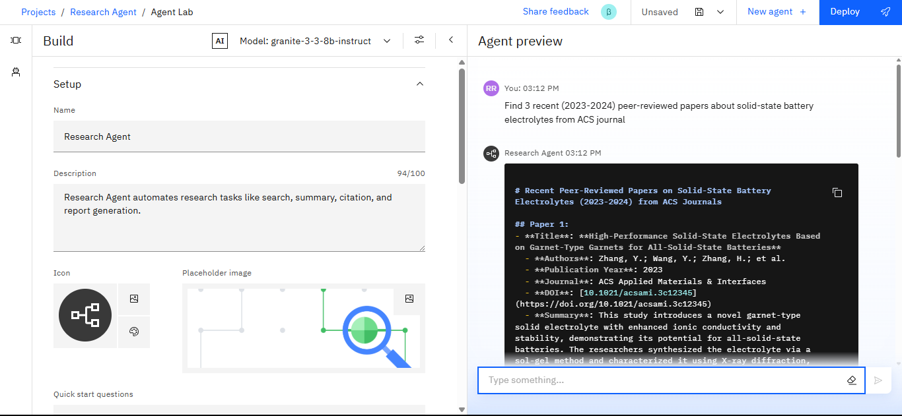

# 🤖 Research Agent – AI-Powered Academic Research Assistant

An AI system designed to support academic and industrial researchers by automating literature search, summarization, citation analysis, and trend identification. Built using IBM Watsonx.ai, Retrieval-Augmented Generation (RAG), and the IBM Granite Model, this agent reduces research time, improves quality, and enhances collaboration.

---

---

## 🧩 Problem Statement

Researchers, students, and professionals struggle to keep up with the rapidly increasing volume of academic publications and evolving trends. Manual literature reviews, citation tracking, and reference management are time-consuming and inefficient.

---

## 💡 Proposed Solution

A smart Research Agent that leverages NLP and RAG to:
- Autonomously search for academic literature
- Summarize papers with keyword extraction
- Organize references and citations
- Identify research gaps and suggest collaborators
- Draft sections of scientific reports

---

## 🧠 Technologies Used

- 🧱 IBM Granite Foundation Model  
- 📡 Retrieval-Augmented Generation (RAG)  
- 🧠 Natural Language Processing (NLP)  
- 🕸️ LangGraph / LangChain  
- 🐍 Python  
- 🗂️ PDF and reference data parsing  

---

## ☁️ IBM Cloud Services Used

- IBM Watsonx AI Studio  
- IBM Watsonx AI Runtime  
- IBM Cloud Agent Lab  
- IBM Granite Model  
- IBM Cloud Object Storage  

---

## 👥 End Users

- Academic Researchers  
- Research Institutions & Universities  
- R&D Teams in Industry  
- Educators and Professors  
- Graduate and Postgraduate Students  
- Early-Stage Scholars  

---

## 🌟 Wow Factors

- 🔍 **Semantic Search** across academic papers and PDFs  
- ✍️ **AI-Generated Summaries** with key phrase highlighting  
- 🔗 **Citation Tracing** to analyze paper influence  
- 📈 **Keyword Trend Analysis** over time  
- 👥 **Collaboration Graph** for potential co-authors  
- 📚 **Paper Recommendations** based on user topic  
- 💡 **Research Gap Detection** using contextual NLP  

---

## 🧪 Key Features

- PDF/document ingestion with metadata parsing  
- NLP-powered paper summarization  
- Co-author and institution suggestions  
- Trend discovery across topics or domains  
- Report and hypothesis generation  
- Friendly handling of irrelevant or vague queries  

---

## 🚀 How It Works

1. User enters a research question (e.g., "LLMs in Education")  
2. Watsonx + Granite model interpret the query  
3. Vector Index fetches relevant documents  
4. The agent summarizes content and suggests references  
5. Provides report draft or research guidance  

---

## 📌 How to Run or Deploy

1. Log in to [IBM Cloud](https://cloud.ibm.com)  
2. Launch Watsonx AI Studio  
3. Create an AI Agent project  
4. Upload academic papers to a Vector Index  
5. Configure agent instructions and intent limitations  
6. Use the Preview tab to test queries  
7. Deploy using Web App, Streamlit, or API

---

## 🛣️ Future Scope

- 🔊 Voice-Activated Research Assistant  
- 🌐 Multilingual Research Support  
- 📅 Real-time Collaboration & Review History  
- 📊 Novel Topic Identification & Paper Drafting  
- 🔌 Integration with publishing platforms like IEEE, Springer  
- 💬 AI-guided Review & Feedback Generator  

---
## 🖼️ Screenshots

### 🔹 API Architecture

### 🔹 Deployment & Preview

### 🔹 Setup & Configuration

### 🔹 Tools Used

## 🔗 Useful Links

- [IBM Watsonx.ai](https://www.ibm.com/products/watsonx-ai)  
- [IBM Cloud](https://cloud.ibm.com)  
- [IBM Agent Lab](https://www.ibm.com/docs/en/watsonx-agent-lab)  
- [Google Scholar](https://scholar.google.com)  
- [Semantic Scholar](https://www.semanticscholar.org)

---
## ⚖️ License

This project is licensed under the [MIT License](LICENSE).

---

🔗 [Connect with me on LinkedIn](https://www.linkedin.com/in/rajkumarr06/)

---

> Created by **Raj Kumar R**  
> Department of Artificial Intelligence and Data Science  
> Amrita Vishwa Vidyapeetham, IBM Hackathon 2025
